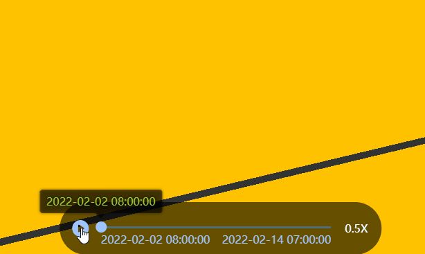
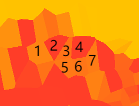

## 时间序列特征

#### 展示几何要素的特征随时间的变化

  
研究区域内 COD 浓度随时间变化过程

#### 可用于渲染如下数据 <br/>



|  | f1 | f2 | f3 | f4 |
| --- | --- | --- | --- | --- |
|t1|0.1|0.20|0.21|0.20|
|t2|0.2|0.21|0.22|0.20|
|t3|0.3|0.28|0.24|0.20|


f[1-n]代表对应的几何要素, t[1-n]代表对应的时间, 表格内容为要素特征的值

---

### API

#### <font color=green>class TimeSeriesFeatureLayer</font>

##### props

| Name       | Summary                                                                                   | Type                                         | Default |
| ---------- | ----------------------------------------------------------------------------------------- | -------------------------------------------- | ------- |
| graphics   | 图元数据                                                                                  | [GraphicProps](#type-GraphicProps)[]         |         |
| tolerance  | 矢量切片误差(像素),地图上 2 个点的距离小于 tolerance 像素则会被合并成一个点, 用于数据简化 | number                                       | 1       |
| source     | 特征的数据源                                                                              | [Source](#type-Source)                       |         |
| tileInfo   | 地图切片信息,mapView 坐标系非 4326 或 3857 时,必须手动指定                                | \_\_esri.TileInfo                            |         |
| curTime    | 当前时间                                                                                  | number                                       |         |
| renderOpts | 渲染选项                                                                                  | [FeatureRenderOpts](#type-FeatureRenderOpts) |         |

##### methods

| Name        | Summary                    | params        |
| ----------- | -------------------------- | ------------- |
| readyAtTime | 在时间 time 时是否可以渲染 | (time:number) |

<a id='type-FeatureRenderOpts'></a>

#### <font color=green>class FeatureRenderOpts</font> <font color="red">[autocast]</font>

##### props

| Name                | Summary          | Type                                                                                                                                                 | Default  |
| ------------------- | ---------------- | ---------------------------------------------------------------------------------------------------------------------------------------------------- | -------- |
| defaultLineWidth    | 默认线宽 1-255   | number                                                                                                                                               | 6        |
| defaultPointSize    | 默认点大小 1-255 | number                                                                                                                                               | 10       |
| defaultPointUpright | 点是否始终朝上   | boolean                                                                                                                                              | false    |
| defaultPointStyle   | 默认点样式       | "circle" &#124; "square" &#124; "triangle"                                                                                                           | "circle" |
| colorMapping        | 颜色映射         | [GradientColorMapping](./color-mapping.md#type-GradientColorMapping) &#124; [ClassBreakColorMapping](./color-mapping.md#type-ClassBreakColorMapping) |          |

<a id='type-GraphicProps'></a>

```typescript
type GraphicProps = {
    geometry: __esri.Point | __esri.Polyline | __esri.Polygon | __esri.Extent | __esri.Multipoint;
    style?: {
        size?: number; //点大小
        type?: "circle" | "square" | "triangle"; //点类型
        isUpright?: boolean; //点是否始终朝上
        lineWidth?: number; //线宽
    };
    [prop: string]: any;
};
```

<a id='type-Source'></a>

```typescript
type Source = {
    times: number[];
    dataGetter: (time: number, index: number) => Promise<ArrayLike<number>>;
};
```

#### example

```typescript
import { TimeSeriesFeatureLayer } from "ff-layer";
import moment from 'moment';
//假如有100个降雨站点, 文件为points.json, 格式为[px,py][]
//有5个时间, 2022-02-02 8:00:00 ~ 2022-02-02 12:00:00, 间隔一小时
//每个时间站点对应的降雨文件为 /{time}_rain.txt, 内容以","分割

const times = [
    "2022-02-02 08:00:00",
    "2022-02-02 09:00:00",
    "2022-02-02 10:00:00",
    "2022-02-02 11:00:00",
    "2022-02-02 12:00:00",
].map((t) => new Date(t).getTime());

const points = (await fetch("/fake-path/points.json").(res=>res.json())) as number[][];

const layer = new TimeSeriesFeatureLayer({
    renderOpts: {
        colorMapping: {
            type: "class-break",
            stops: [
                { min: 0, max: 2, color: "#7fffff" },
                { min: 2, max: 4, color: "#23b7ff" },
                { min: 4, max: 6, color: "#0177b4" },
                { min: 6, max: 8, color: "#0052ca" },
                { min: 8, max: 10, color: "#0310d8" },
                { min: 10, max: 20, color: "#9601f9" },
                { min: 20, max: 50, color: "#6f00b8" },
                { min: 50, max: 100, color: "#4c0082" }
            ]
        },
    },
    graphics: points.map(([x, y]) => {
        return {
            geometry: {
                type: "point",
                x,
                y,
                spatialReference: { wkid: 4326 },
            } as __esri.Point,
        };
    }),
    source: {
        //所有时间
        times,
        //获取在某个时间所有站点的降雨值, 与graphics顺序一致
        dataGetter(time: number, index: number) {
            const date = moment(time).format('YYYY-MM-DD HH:mm:ss');
            return fetch(`/${date}_rain.txt`)
                  .(res => res.text())
                  .then(str=> str.split(',').map(v => +v))
        },
    },
});

//animation
let time = times[0];
layer.curTime = time;
const interval = 1000 * 60 * 5;//5 min
requestAnimationFrame(function loop(){
    const nextTime = time + interval;
    if(layer.readyAtTime(nextTime)){
        time = layer.curTime = nextTime;
    }
    requestAnimationFrame(loop)
});
```
