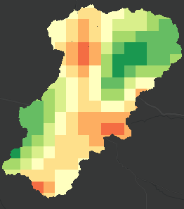

## 时间序列克里金

#### 基于克里金插值的时序变化


某时间段某区域降雨过程

#### 可用于渲染如下数据 <br/>

| 时间\点位 | (110, 28) | (111,28.5) | (111, 29) | (110, 27) |
| --------- | --------- | ---------- | --------- | --------- |
| 8:00      | 1         | 2          | 3         | 4         |
| 9:00      | 2         | 3          | 6         | 2         |
| 10:00     | 5         | 5          | 4         | 1         |

第一行为 N 个点位坐标, 剩余行为在给定时间,各点的降雨值

---

### API

#### <font color=green>class TimeSeriesKrigingLayer</font>

##### props

| Name       | Summary  | Type                                                     | Default |
| ---------- | -------- | -------------------------------------------------------- | ------- |
| source     | 数据源   | [TimeSeriesKrigingSource](#type-TimeSeriesKrigingSource) |         |
| curTime    | 当前时间 | number                                                   |         |
| renderOpts | 渲染选项 | [KrigingRenderOpts](#type-KrigingRenderOpts)             |         |

##### methods

| Name        | Summary                    | params        |
| ----------- | -------------------------- | ------------- |
| readyAtTime | 在时间 time 时是否可以渲染 | (time:number) |

<a id='type-KrigingRenderOpts'></a>

#### <font color=#006400>class KrigingRenderOpts</font> <font color="red">[autocast]</font>

##### props

| Name           | Summary        | Type                                                                                                                                                 | Default  |
| -------------- | -------------- | ---------------------------------------------------------------------------------------------------------------------------------------------------- | -------- |
| renderSampling | 渲染采样方式   | "nearest" &#124; "linear"                                                                                                                            | "linear" |
| clipPolygon    | 用于裁剪的面   | \_\_esri.Polygon &#124; \_\_esri.Polygon[]                                                                                                           |          |
| useClip        | 是否应用面裁剪 | boolean                                                                                                                                              | true     |
| krigingOpts    | 克里金参数     | [KrigingOpts](#type-KrigingOpts)                                                                                                                     |          |
| colorMapping   | 颜色映射       | [GradientColorMapping](./color-mapping.md#type-GradientColorMapping) &#124; [ClassBreakColorMapping](./color-mapping.md#type-ClassBreakColorMapping) |          |

<a id='type-TimeSeriesKrigingSource'></a>

```typescript
type TimeSeriesKrigingSource = {
    points: { x: number; y: number }[]; //所有点的位置
    spatialReference: __esri.SpatialReference; //参考系
    times: number[]; //全部时间序列
    dataGetter: (time: number, index: number) => Promise<number[]>; //获取在给定时间,所有点对应的值
};
```

<a id='type-KrigingOpts'></a>

```typescript
type KrigingOpts = {
    model?: KrigingModel; //"gaussian" | "exponential" | "spherical", 默认"exponential"
    sigma2?: number; //默认0,
    alpha?: number; //默认100,
    gridExtent?: __esri.Extent; //要插值的范围, 默认是包含所有source点的extent扩充1.5倍
    splitCount?: number; //gridExtent宽高中较小的划分为多少网格，默认是100
};
```

| clipPolygon & useClip                                | 裁剪                               | 不裁剪                                   |
| ---------------------------------------------------- | ---------------------------------- | ---------------------------------------- |
| 定义裁剪的范围, 当 clipPolygon 存在时 useClip 才生效 |  |  |

| gridExtent                                                               |                                            |
| ------------------------------------------------------------------------ | ------------------------------------------ |
| 蓝色范围为所有点的范围, 红色范围即 gridExtent, 默认是蓝色范围扩充 1.5 倍 |  |

| renderSampling | nearest                                  | linear                                 |
| -------------- | ---------------------------------------- | -------------------------------------- |
| 渲染采样的方式 |  |  |

| splitCount                               | 20                                   | 50                                   | 200                                    |
| ---------------------------------------- | ------------------------------------ | ------------------------------------ | -------------------------------------- |
| 分割的栅格数目, 越大越详细, 计算量也越大 |  |  |  |

model, sigma2, alpha 参数参考[kriging.js](#https://github.com/oeo4b/kriging.js)

---

#### example

```typescript
import { TimeSeriesKrigingLayer } from "ff-layer";
import moment from "moment";

const times = [
    "2022-02-02 08:00:00",
    "2022-02-02 09:00:00",
    "2022-02-02 10:00:00",
    "2022-02-02 11:00:00",
    "2022-02-02 12:00:00",
].map((t) => new Date(t).getTime());

const layer = new TimeSeriesKrigingLayer({
    renderOpts: {
        colorMapping: {
            type: "class-break",
            truncHead: true,
            breaks: [
                { min: 1, max: 2, color: "#1a9850" },
                { min: 2, max: 3, color: "#66bd63" },
                { min: 3, max: 4, color: "#a6d96a" },
                { min: 4, max: 5, color: "#d9ef8b" },
                { min: 5, max: 6, color: "#ffffbf" },
                { min: 6, max: 7, color: "#fee08b" },
                { min: 7, max: 8, color: "#fdae61" },
                { min: 8, max: 9, color: "#f46d43" },
                { min: 9, max: 10, color: "#d73027" },
                { min: 10, max: 15, color: "#a50026" },
            ],
        },
    },
    source: {
        points: [
            { x: 112.399200289, y: 36.9491050183 },
            { x: 112.549136249, y: 37.1006417175 },
            { x: 112.549669829, y: 37.199354004 },
            { x: 112.350644516, y: 36.9987279515 },
            { x: 112.550203409, y: 37.0499516245 },
            { x: 112.449890382, y: 37.1001081376 },
            { x: 112.601427082, y: 37.2004211638 },
            { x: 112.499513316, y: 37.1497310708 },
            { x: 112.501647635, y: 36.9997951113 },
            { x: 112.449890382, y: 36.9507057581 },
        ],
        spatialReference: { wkid: 4326 } as __esri.SpatialReference,
        times,
        dataGetter: (t: number, tIndex: number) => {
            return Promise.resolve(new Array(10).fill(0).map((i) => Math.random() * 15));
        },
    },
});

//animation
let time = times[0];
layer.curTime = time;
const interval = 1000 * 60 * 5; //5 min
requestAnimationFrame(function loop() {
    const nextTime = time + interval;
    if (layer.readyAtTime(nextTime)) {
        time = layer.curTime = nextTime;
    }
    requestAnimationFrame(loop);
});
```
