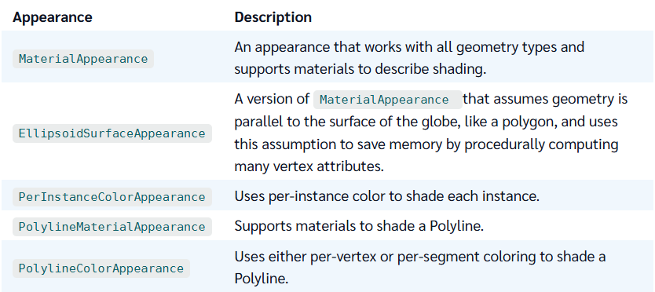

前几篇文章中我们介绍了Primitive的相关内容，我们会发现在Primitive中Appearance是Primitive的重要组成部分。

我们已经可以简单的使用Appearance来设置Primitive几何图形的外观。

这篇文章，我们来详细的了解一下Appearance。

# Appearance分类
Cesium中一共有以下几种Appearance，不同的Appearance适用于不同的场景，如果你在某个场景中，使用错了Appearance，会导致看不见渲染结果的。

# MaterialAppearance 材质外观
