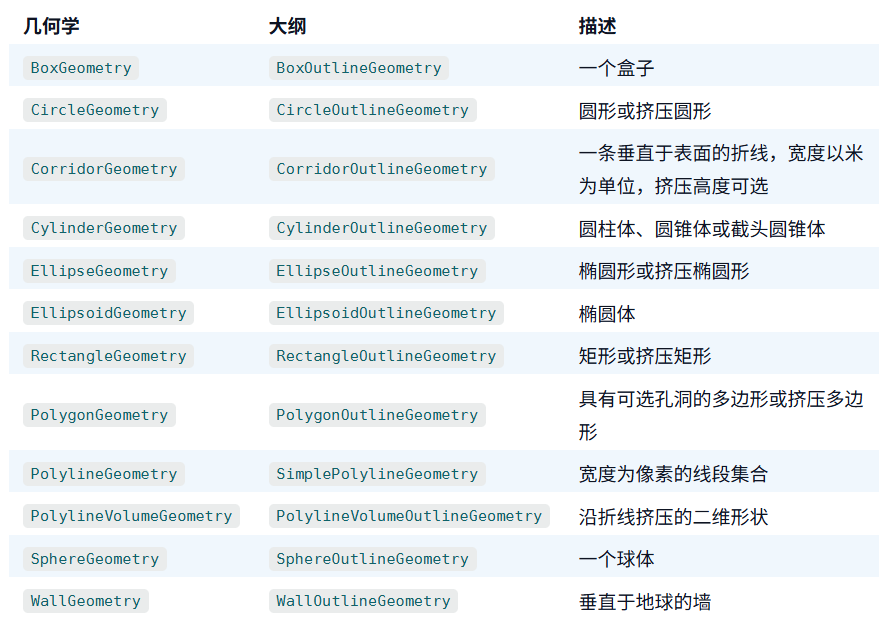

# Entity与Primitive

这里会有一个疑问，为什么要有两套绘制图形的接口呢？
> Entity是Cesium封装的较高级的绘图接口，适用于普通的开发人员，即使你没有图形开发技术，你能快速使用Entity在场景中绘制各种几何形状。

> Primitive是Cesium封装的低级的绘图接口，它的绘图方式接近渲染引擎底层，但又可以不直接使用WebGL底层的接口，主要面向图形开发人员。

这里也就意味着使用Primitive进行图形绘制时需要具备一定的图形相关开发知识。

# Primitive的构成

上面的实例是使用Primitive创建圆并渲染到场景中，通过这个实例我们发现创建一个Primitive必须设置 geometry与 appearance 两个属性，才能在场景中渲染出来。

# Geometry与Appearance

> geometry： 代表要显示的几何形状。

> appearance： 代表该几何的外观样式。

即geometry形成一个骨架，appearance表示对geometry上色。
> 一个Primitive中可以包含多个Geometry，但是只能有一个Appearance

比如下方的案例代码：

## 大数据量展示

每个Geometry是通过GeometryInstance来进行实例化的，通过GeometryInstance对Geometry进行实例化，同一个Geometry可以被实例化多次。
这对于展示大量数据时很有用，比如有10万个BoxGeometry需要被显示，我们只需要创建一个BoxGeometry，然后通过GeometryInstance来设置每一个的大小、位置、颜色等。

## 拾取

我们还可以通过对GeometryInstance设置一些属性来进行Geometry的识别，当一个Primitive中装载有多个Geometry时，我们在鼠标交互的时候如果希望知道拾取到的是那个Geometry
那么就可以通过GeometryInstance设置一个`id`，这样我们就知道拾取到的是哪个Geometry。

## 一个geometry设置一个颜色

需要注意的是，因为一个Primitive只能设置一个Appearance，所以当一个Primitive装载有多个Geometry时，这些Geometry只能具有相同的外观。
我们可以通过`PerInstanceColorAppearance`类型的外观为每个Geometry实例设置一个颜色。

# Primitive的优缺点

## 优点:

1. 灵活度高，因为Primitive由Geometry和Appearance构成，我们可以单独修改它们。
2. 性能好。使用Primitive可以将多个Geometry合并为一个大的Geometry来减少CPU的使用，利用GPU。
3. 自定义渲染强，我们有很大的可编程性。可以操作顶点着色器与片元着色器。

## 缺点:

1. 对于动态数据不友好，使用primitive组合多个geometry时无法更新geometry。
2. 使用复杂。编写代码增加，需要图形学知识。

# Primitive的分类

Cesium中除了Primitive类以外，还有一些以Primitive结尾的类。

## new Cesium.GroundPrimitive(options)

贴地Primitive，将几何图形贴地使用。适用于平面类型的Geometry,如:CircleGeometry,PolygonGeometry,RectangleGeometry。
贴地Primitive通过设置`classificationType`来设置贴的目标。

## new Cesium.ClassificationPrimitive(options)

分类Primitive，将几何体贴模型高亮显示，常用于高亮显示模型。比如倾斜摄影分层单体化或者分户单体化。

## new Cesium.GroundPolylinePrimitive(options)

贴地线Primitive

## new Cesium.PointPrimitive()

通过调用PointPrimitiveCollection#add创建点并设置其初始属性。不要直接调用构造函数

## new Cesium.PointPrimitiveCollection(options)

点集合

## new Cesium.VoxelPrimitive(options)

体渲染

## new Cesium.DebugCameraPrimitive(options)

相机可视化Primitive，常用于调试相机的相关参数，这个后面涉及到折射反射等功能。

# Primitive的几何类型

## BoxGeometry 盒子几何

创建一个BoxGeometry盒子几何时，我们一般采用`BoxGeometry.fromDimensions()`方法进行创建，而不是采用new BonxGeometry() 方法，因为`fromDimensions`
可以直接设置盒子的`长宽高`。 其次，BoxGeometry没有提供设置位置的属性，所以我们通过GeometryInstance中的`modelMatrix` 属性将其定位到地球的正确位置上。

## CircleGeometry 圆几何

CirCleGeometry中：

- center属性设置圆几何的位置与中心点
- radius属性设置圆几何的半径
- height属性设置圆几何的高度
- extrudedHeight属性设置拉伸高度，此属性可创建一个圆柱几何 。 拉伸高度是指从`当前圆几何的高度拉伸到那个高度`
  ，比如我当前圆几何的高度为5000，设置拉伸高度1000，那么就是从上往下拉伸，那么此时圆柱几何的高度应为5000-1000=4000。

## CorridorGeometry 走廊

CorridorGeometry中：

- positions属性设置走廊的位置。
  注意：上述方法坐标里面的z值（上面的0）会被忽略的。如果不想写z值，可以使用Cesium.Cartesian3.fromDegreesArray([120.0, 30.0, 120.1, 30.0, 120.1, 30.1])
  方法。高度是通过height属性设置的。
- width属性设置走廊几何的宽度。
- height属性设置走廊几何的高度。
- extrudedHeight属性设置拉伸高度
- cornerType属性设置转角样式

## CylinderGeometry 锥体几何

CylinderGeometry中：

- length属性设置锥体几何的高度。
- topRadius属性设置锥体几何的顶部半径。
- bottomRadius属性设置锥体几何的底部半径。

如果顶部半径与底部半径设置的一样，则显示的效果就是圆柱。

- slices属性设置锥体几何的变数，即切割成多少份。

圆柱体周边的边数,几何体还支持分段，也就是分成几段再细分三角形，分段越多顶点和三角形越多，渲染越精细,顶点越多，性能也会变差

## EllipseGeometry 椭圆几何

EllipseGeometry与CircleGeometry很相似，只是EllipseGeometry可以设置长半径与短半径，长半径与短半径相同时就是CircleGeometry。 CirCleGeometry中：

- center属性设置椭圆几何的位置与中心点。
- semiMajorAxis属性设置椭圆几何的长半径。
- semiMinorAxis属性设置椭圆几何的短半径。
- height属性设置椭圆几何的高度。
- extrudedHeight属性设置拉伸高度

## EllipsoidGeometry 椭球体

EllipsoidGeometry中：

- radii属性设置椭球体在 x、y 和 z 方向上的半径。

如果将radii中三个方向的半径设置为相等的值，得到的就是一个正球体。

## RectangleGeometry 矩形几何
RectangleGeometry中：
- rectangle属性从一个点集中获取一个数据的外包矩形。
- extrudedHeight属性设置拉伸高
## PolygonGeometry 多边形几何
PolygonGeometry中：
多边形几何有两种方法设置其高度，
第一种就是上述代码中运用到的，启用顶点数组中的高度值。
- polygonHierarchy 属性设置  new Cesium.PolygonHierarchy(positions)
- perPositionHeight
  第二种方法就是使用height属性,这种方法会将所有的点高度设置为统一值。
- polygonHierarchy 属性设置  new Cesium.PolygonHierarchy(positions)
- height 属性设置高度

## PolylineGeometry 线几何
PolylineGeometry中：
需要使用专门的`PolylineMaterialAppearance外观`
PolylineGeometry支持传入顶点颜色，实现渐变样式。
- `PolylineColorAppearance`

## PolylineVolumeGeometry 管道
- `PolylineVolumeGeometry` 先创建它的切面形状，
- computeCircle 方法用于创建一个圆形的切面形状
## SphereGeometry

## WallGeometry

# 自定义Primitive
