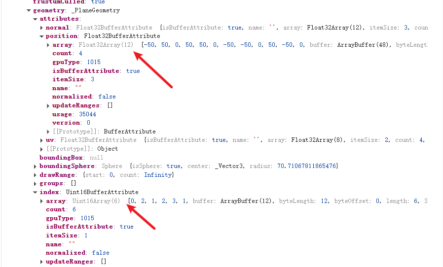
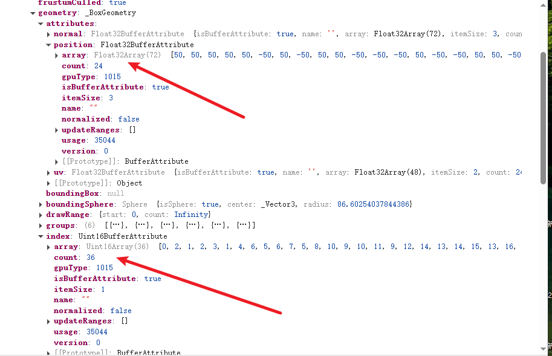

## BufferGeometry：顶点生成各种几何体
Three.js 提供了很多几何体， 它们都是基于 `BufferGeometry` 封装出来的

> 通过 geometry.attributes.position存储顶点数据
> 通过 geometry.index 存储顶点索引
> 

网格模型 Mesh 就是由三角形构成的，不管是简单，还是复杂的外部模型，都是三角形构成
> 本质就是顶点和三角形
>
# Geometry api原理
```javascript
new THREE.PlaneGeometry(100, 100)
// 4 个顶点数据,6 个顶点索引 => 构成 2 个三角形
```

```javascript
new THREE.BoxGeometry(100, 100,100)
// 24个顶点,36个顶点索引 => 构成 12个三角形,每个面2个三角形
```

