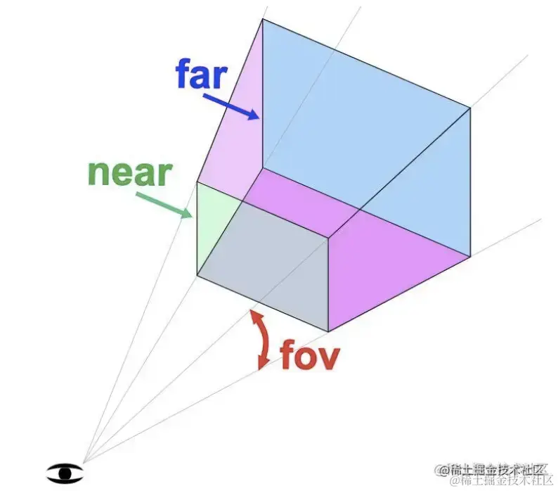

## 透视相机和视锥体

### OrbitContols 鼠标操作
> - 鼠标左键拖动可以上下左右旋转
> - 鼠标左键拖动可以上下左右旋转
> - 鼠标右键拖动可以平移

### PerspectiveCamera

> - fov：影响可视范围角度、离物体远近
> - aspect：可视范围宽高比，一般设置网页宽高比
> - near：近裁截面距离，一般保持默认值 0.1，当你需要截掉一些特别近的物体的时候，把它加大
> - far：远裁截面距离，如果有的物体被裁截掉看不到了，就需要调大 far 把它们包含进来
