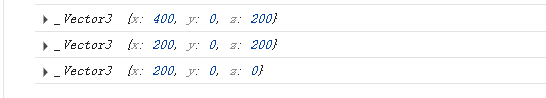
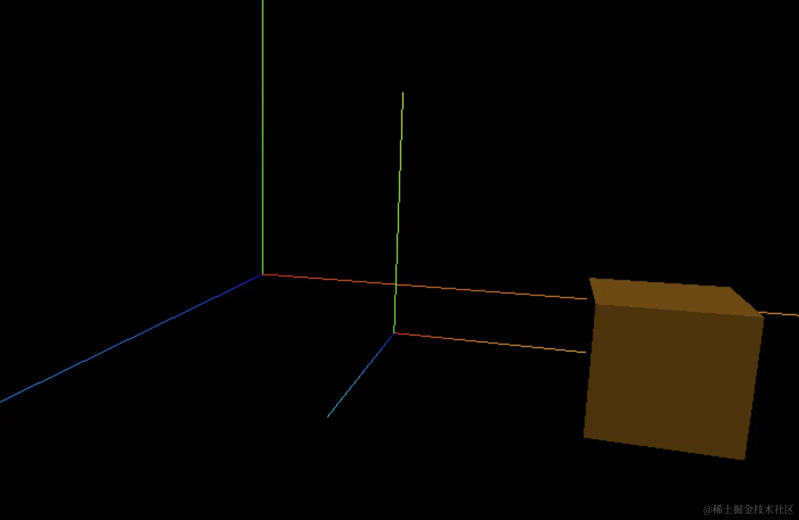

## 场景遍历和世界坐标系
### 场景遍历
遍历这对象树，获取想要拿到的mesh
- 方式1：`traverse`
```javascript
scene.traverse((obj) => {
  if(obj.isMesh) {
    obj.material.color = new THREE.Color('pink');// 场景中遍历是否为 mesh 的对象
  }
});
```
- 方式2:`getObjectByName`、`getObjectById`
```javascript
mesh.name ='cube'
// ...
const cube = scene.getObjectByName('cube');// 场景中遍历 name
```

### 世界坐标系和局部坐标系
将 `mesh` 放置 `group` 中
```javascript
group = new THREE.Group()
const geometry = new THREE.BoxGeometry(100, 100, 100);
const material = new THREE.MeshLambertMaterial({
  color: new THREE.Color('orange')
});
const mesh = new THREE.Mesh(geometry, material);
mesh.name ='cube'
group.add(mesh)
scene.add(group)
// mesh.translateZ(200);
// scene.add(mesh)
group.position.x = 200
group.translateZ(200);
mesh.position.x = 200;
```
其中可用 `getWorldPosition` 获取所在mesh的世界坐标系(即实际坐标+group做白哦)
```javascript
const pos = new THREE.Vector3()
mesh.getWorldPosition(pos)
console.log(pos) // mesh的世界坐标系
console.log(group.position) // group本身坐标系
console.log(mesh.position)// mesh本身坐标系
```


