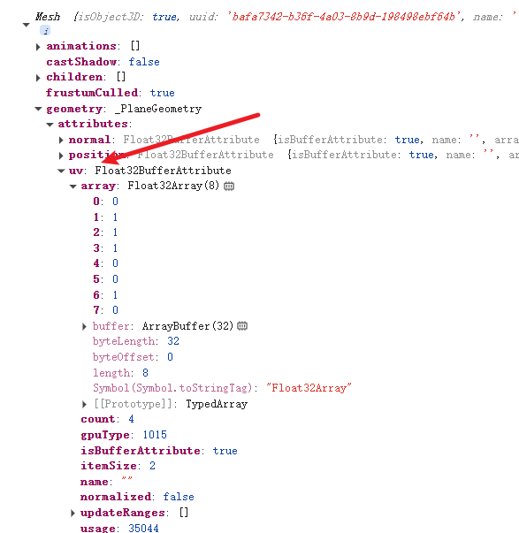

## uv 坐标和 uv 动画
### uv 坐标
颜色贴图是根据 `uv坐标`来取纹理图片中的对应位置的颜色

> 其中 `geometry.attributes.uv` 就是和顶点一一对应的，相当于平铺整张图片
>自定义坐标
```javascript
uvs = new Float32Array([ // 仅显示左下角部分
 0, 0.5,
 0.5, 0.5,
 0, 0,
 0.5, 0
])
geometry.attributes.uv = new THREE.BufferAttribute(uvs, 2)
```
### uv动画
可以修改 `texture.offset.y`  可以移动纹理贴图，实现动画效果
```javascript
mesh.material.map.offset.y += 0.001;
texture.wrapT = THREE.RepeatWrapping; // 竖直方向重复
```
