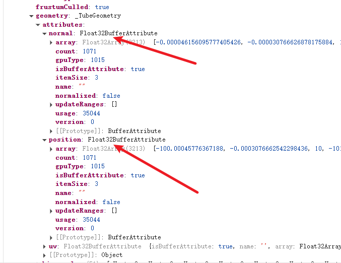

## `geometry.attributes.normal`
### 每个顶点都有一个法线方向
- 每个顶点都有一个法线方向，光线的入射角就是光和法线形成的夹角，`入射角`和`出射角`一致
- `geomety.attributes.positon` 记录了顶点坐标
- `geometry.attributes.normal` 记录了和顶点一一对应的法线方向
- 如果一个顶点没有`法线方向`,则看不到光照


### BufferGeometry自定义的几何体要定义和顶点坐标对应的法线方向

`BufferGeometry` 定义了法线方向,才能用漫反射或者镜面反射材质来计算`反光效果`

```javascript
vertices = new Float32Array([
  0, 0, 0,
  100, 0, 0,
  0, 100, 0,
  100, 100, -100
]);
geometry = new THREE.BufferGeometry()
// 需要加上法线方向，才能看到光照
const normals = new Float32Array([
0, 0, 1,
0, 0, 1,
0, 0, 1,
1, 1, 0
]);
geometry.attributes.normal = new THREE.BufferAttribute(normals, 3);
attribute = new THREE.BufferAttribute(vertices, 3)
geometry.attributes.position = attribute;
const indexes = new Uint16Array([
  0, 1, 2, 2, 1, 3
]);
geometry.index = new THREE.BufferAttribute(indexes, 1)

material = new THREE.MeshPhongMaterial({
  color: new THREE.Color('orange'),
  shininess: 1000
});
```
