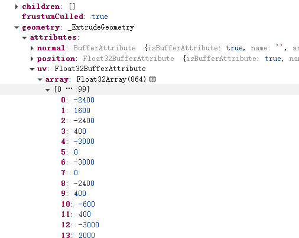

## 盖房子
### 曲线和生成几何体
1. 不用镂空的集合体可以用`BoxGeometry`
2. 需要镂空的几何体需要使用`ExtrudeGeometry`拉伸,shape.`holes` 可以定义内孔
```javascript
const shape = new THREE.Shape();
  shape.moveTo(0, 0);
  shape.lineTo(0, 2000);
  shape.lineTo(-1500, 3000);
  shape.lineTo(-3000, 2000);
  shape.lineTo(-3000, 0);

  const windowPath = new THREE.Path(); // 添加路径镂空
  windowPath.moveTo(-600, 400);
  windowPath.lineTo(-600, 1600);
  windowPath.lineTo(-2400, 1600);
  windowPath.lineTo(-2400, 400);
  shape.holes.push(windowPath);

  const geometry = new THREE.ExtrudeGeometry(shape, {
    depth: 100
  });
```

#### 纹理贴图
1. `BoxGeometry`是处理过的uv坐标，其单位为1
2. `ExtrudeGeometry`,为进行处理，uv 坐标会很大
> 需要设置 texture.repeat 为很小的值
> 原则就是和 uv 坐标相乘等于 `1`


#### lil-gui 可视化调试
当调整模型位置时，可以使用`lil-gui`可视化调试

#### 相机动画
```javascript
const rotateFn = () => { // 相机旋转
  angle += 0.01
  if (angle >= Math.PI * 2) {
    angle -= Math.PI * 2;
    r = 5000 + Math.random() * 10000;
    camera.position.y = 1000 + Math.random() * 10000;
  }
  camera.position.x = r * Math.cos(angle);
  camera.position.z = r * Math.sin(angle);
  camera.lookAt(0, 0, 0)
}
```
